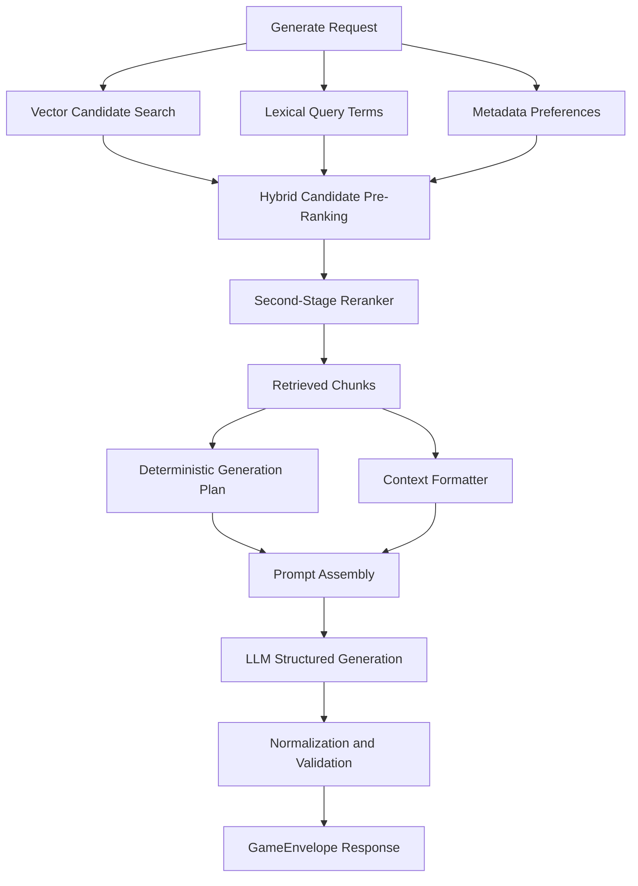
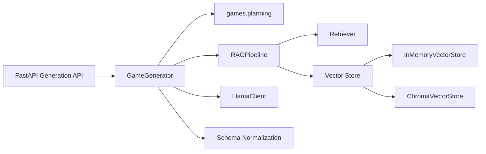
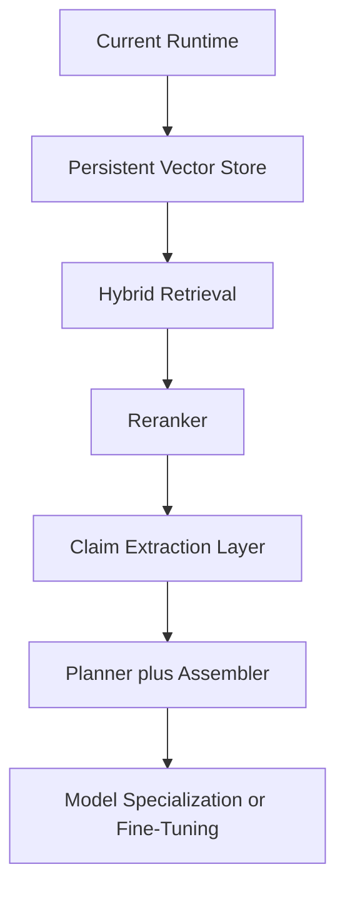

# Generation Pipeline Architecture

Last updated: 2026-05-03.

## Purpose

This document describes the runtime generation path after the first grounding refactor.

The main change is that ai-engine no longer treats retrieved chunks as the only intermediate artifact before final generation. The runtime now uses:

1. retrieval and grounding
2. a deterministic generation plan built from retrieved evidence
3. final structured generation using both the plan and the retrieved context

## Why This Change Exists

The previous flow was effective as a generic RAG prototype but too weak for stable structured outputs. The model still had to infer topic focus, source salience, and object structure in one pass.

The new plan layer improves three things:

- stronger grounding for structured outputs
- better observability because the intermediate evidence selection is explicit
- a cleaner path toward future reranking and multi-stage extraction

## Runtime Flow

## Component View

## Retrieval and Storage

The runtime vector store is now a configuration concern instead of a hard-coded in-memory choice.

- memory backend is still the default for tests and disposable local runs
- chroma backend is available for persistent development and integration slices
- the curated RAG seed corpus is versioned as JSONL package data and can be
    pre-indexed with `python -m ai_engine.cli.build_rag_index`

The retrieval path is now hybrid in two layers:

- vector similarity still provides the initial candidate set
- metadata preferences and filters continue to bias routing toward the right language and game type during candidate pre-ranking
- lexical overlap between query terms and retrieved content or metadata contributes to the pre-ranking score
- an explicit second-stage reranker can then rescore the top candidates independently of the heuristic pre-ranking logic

Relevant settings:

- AI_ENGINE_VECTOR_STORE_BACKEND
- AI_ENGINE_VECTOR_STORE_PATH
- AI_ENGINE_VECTOR_STORE_COLLECTION
- AI_ENGINE_RETRIEVER_LEXICAL_CONTENT_MATCH_BOOST
- AI_ENGINE_RETRIEVER_LEXICAL_METADATA_MATCH_BOOST
- AI_ENGINE_RETRIEVER_RERANKER_BACKEND
- AI_ENGINE_RETRIEVER_RERANK_CANDIDATE_COUNT
- AI_ENGINE_RETRIEVER_RERANK_SCORE_WEIGHT

## Intermediate Plan Shape

The generation plan is deterministic and typed. It currently captures:

- topic
- game type
- language
- source labels derived from retrieved metadata
- evidence excerpts derived from retrieved documents

This is intentionally simple. It is a stable bridge toward stronger stages such as reranking, claim extraction, and constraint-aware assembly.

## Migration Path

## Recommended Next Steps

1. replace fixed-size chunking with source-aware chunk boundaries
2. add lexical plus vector retrieval before reranking
3. promote the generation plan from evidence summary to claim-level extraction
4. expose plan diagnostics and reranker score breakdowns in observability endpoints